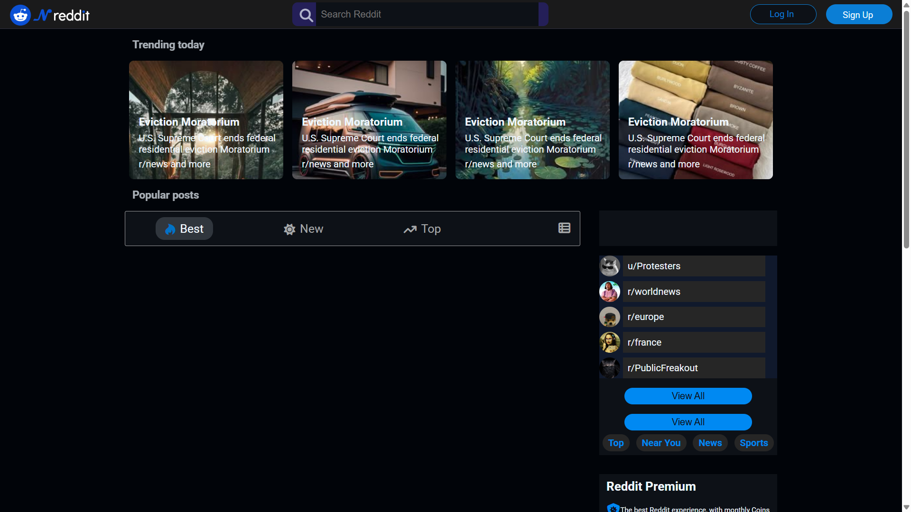

# 🤖 Reddit Clone

A full-stack Reddit-inspired web application with a real backend, database, and live deployment.

## 📸 Preview



## 🚀 Live Demo

[reddit.onrender](https://reddit-dcwz.onrender.com/)

## 🛠️ Built With

**Frontend:**
- HTML5, CSS3, JavaScript (ES6+)

**Backend:**
- Node.js
- Express.js
- PostgreSQL + PLpgSQL

**Deployment:**
- Render

## 📁 Project Structure

```
Reddit/
├── public/       # Frontend (HTML, CSS, JS)
├── server/       # Backend (Express API, DB queries)
├── package.json
└── README.md
```

## ⚙️ Getting Started

### Prerequisites
- Node.js
- PostgreSQL

### Installation

```bash
git clone https://github.com/Nour-Agha99/Reddit.git
cd Reddit
npm install
```

Set up your environment variables:

```bash
# Create a .env file
DB_HOST=localhost
DB_PORT=5432
DB_NAME=reddit_db
DB_USER=your_user
DB_PASSWORD=your_password
```

Run the app:

```bash
npm start
```

Open [http://localhost:3000](http://localhost:3000) in your browser.

## ✨ Features

- Browse and view posts
- Create and submit new posts
- Full-stack architecture with REST API
- PostgreSQL database integration
- Live deployment on Render

## 👤 Author

**Nour ALagha**
- GitHub: [@Nour-Agha99](https://github.com/Nour-Agha99)
- Email: NourAgha1099@gmail.com